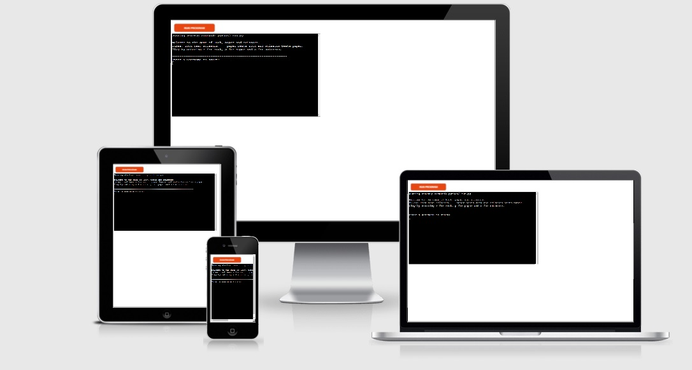
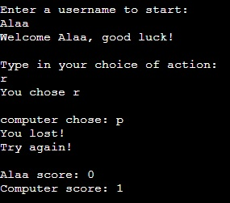
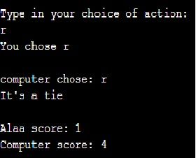

# Rock Paper and Scissors
Rock paper and scissors is a Python terminal game wish runs in the mock terminal on Heroku.

A user can challenge the computer for a game of rock, paper and Scissors,
Almost everyone knows the game, rules are simple: rock beat scissors, paper beats rock and scissors beats paper.
You just have to get lucky or maybe read the mind of the opponont?

### [Rock Paper and scissors](https://r-p-s-my-python-game.herokuapp.com/)
 

 

## Features

input to register the user's username

Player can type to chooce an action:
By typoing r for rock p for paper and s for scissors.
added an input validation to only accept one of those 3 letters,
otherwise it will return an error and ask the user to enter a correct value.

the computer will also choose one of the 3 options randomly.

the app will caclulate the winner and print out who wins while displaying the score for both the user and the computer.
additional feature is that the app will print a randomly selected sentence when player wins , or lose
 

if both the player and the computer choce the same action it will count as a tie, and none will get any score.
 

 
## Testing

I test the project by doing the following:
<ul>
<li>Passed the code through a OEO8 linter and confirmed there are no problems</li>
<li>Gave invalid input to confirm that only (r,p,s) are accepted and any other value returns a ValueError</li>
<li>Tested the game in my local gitpod terminal and my Heroku terminal.</li>
</ul>
 

## Bugs

Solved Buygs:
<ul>
<li>I have encountered a bug where the score would only count up to one, because i had the score caclulated as score = + 1 but i was able to solve the bug by incrementing the new socre every time: score = score + 1</li>
<li>another fixed bug was that when the game supposed to print a random win or lose statment into the terminal was returning only (None), and solved it by adding (return) to the function
</li>
<li>another bug where once you start the game u will get the same win or lose sentence out of the random win or lose sentence functions, and that was because i had passed the function inside a while loop, so a user would only get a new win or lose sentence when starting a new game, i solved the bug by passing the function before the while loop starts.
</li>
</ul>

all bugs were fixed, and the game runs bug free!
 

## Deployment

this project was deployed using Code Institute's mock terminal for Heroku, wish was provided by the code institute python-essentials-template.

steps taken for deployments:
<ul>
<li>Create a new Heroku app
</li>
<li>added config var(PORT, 8000)</li>
<li>Set the buildbacks to Python and NodeJS in that order</li>
<li>Link the Heroku app to the repository</li>
<li>Enabled automatic deployment from main</li>
<li>Click on Depoly</li>
</ul>

 

## Credits

<ul>
<li>pynative.com where i found an informative article about random method to be able to make the computer random a choice and select a random win or lose statments.
</li>
</ul>